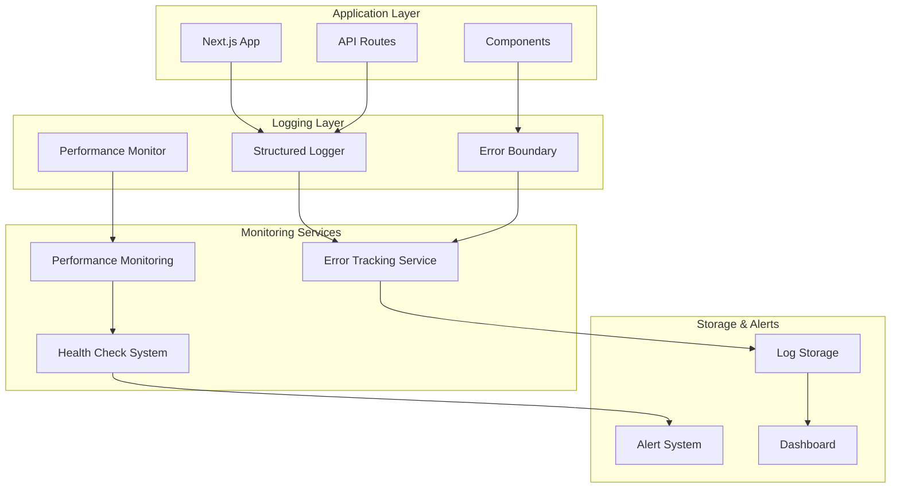
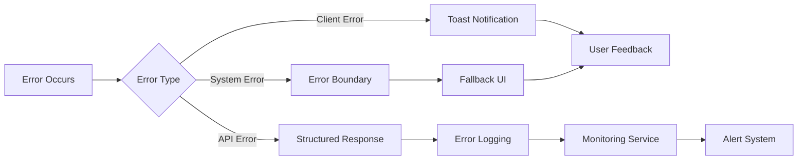

# Design Document

## Overview

This design document outlines the comprehensive approach to make the unified booking platform production-ready by removing all placeholder code, implementing missing functionality, establishing proper error handling and logging, and ensuring all features are complete and secure. The design focuses on systematic cleanup and enhancement of the existing codebase while maintaining the current architecture and functionality.

## Architecture

### Production Logging Architecture



### Error Handling Strategy



## Components and Interfaces

### 1. Production Logger Service

```typescript
interface ProductionLogger {
  info(message: string, context?: Record<string, any>): void;
  warn(message: string, context?: Record<string, any>): void;
  error(message: string, error?: Error, context?: Record<string, any>): void;
  debug(message: string, context?: Record<string, any>): void;
}

interface LogEntry {
  level: 'info' | 'warn' | 'error' | 'debug';
  message: string;
  timestamp: Date;
  context?: Record<string, any>;
  error?: {
    name: string;
    message: string;
    stack?: string;
  };
  requestId?: string;
  userId?: string;
  sessionId?: string;
}
```

### 2. Toast Notification System

```typescript
interface ToastNotification {
  id: string;
  type: 'success' | 'error' | 'warning' | 'info';
  title: string;
  message?: string;
  duration?: number;
  action?: {
    label: string;
    onClick: () => void;
  };
}

interface ToastService {
  success(title: string, message?: string): void;
  error(title: string, message?: string): void;
  warning(title: string, message?: string): void;
  info(title: string, message?: string): void;
  dismiss(id: string): void;
  dismissAll(): void;
}
```

### 3. PDF Generation Service

```typescript
interface PDFGenerationService {
  generateInvoice(bookingId: string): Promise<Buffer>;
  generateReceipt(paymentId: string): Promise<Buffer>;
  generateReport(reportData: ReportData): Promise<Buffer>;
}

interface InvoiceData {
  booking: Booking;
  customer: User;
  provider: Provider;
  services: Service[];
  pricing: PricingBreakdown;
  paymentInfo: PaymentInfo;
  companyInfo: CompanyInfo;
}
```

### 4. Health Check System

```typescript
interface HealthCheckService {
  checkDatabase(): Promise<HealthStatus>;
  checkRedis(): Promise<HealthStatus>;
  checkExternalServices(): Promise<HealthStatus>;
  getOverallHealth(): Promise<OverallHealth>;
}

interface HealthStatus {
  status: 'healthy' | 'degraded' | 'unhealthy';
  responseTime: number;
  details?: Record<string, any>;
  lastChecked: Date;
}

interface OverallHealth {
  status: 'healthy' | 'degraded' | 'unhealthy';
  services: Record<string, HealthStatus>;
  uptime: number;
  version: string;
}
```

### 5. Enhanced Error Boundaries

```typescript
interface ErrorBoundaryProps {
  fallback?: React.ComponentType<ErrorFallbackProps>;
  onError?: (error: Error, errorInfo: ErrorInfo) => void;
  isolate?: boolean;
  resetKeys?: Array<string | number>;
}

interface ErrorFallbackProps {
  error: Error;
  resetError: () => void;
  hasError: boolean;
}
```

## Data Models

### Enhanced Logging Schema

```typescript
interface AuditLog {
  id: string;
  userId?: string;
  sessionId?: string;
  action: string;
  resource: string;
  resourceId?: string;
  details: Record<string, any>;
  ipAddress: string;
  userAgent: string;
  timestamp: Date;
  status: 'success' | 'failure';
}

interface ErrorLog {
  id: string;
  level: 'error' | 'warn';
  message: string;
  stack?: string;
  context: Record<string, any>;
  userId?: string;
  sessionId?: string;
  requestId?: string;
  timestamp: Date;
  resolved: boolean;
  resolvedAt?: Date;
  resolvedBy?: string;
}
```

### Performance Metrics Schema

```typescript
interface PerformanceMetric {
  id: string;
  metricType: 'api_response_time' | 'page_load_time' | 'database_query_time';
  value: number;
  unit: 'ms' | 'seconds' | 'bytes';
  endpoint?: string;
  userId?: string;
  timestamp: Date;
  metadata?: Record<string, any>;
}
```

## Error Handling

### Centralized Error Processing

```typescript
class ProductionErrorHandler {
  private logger: ProductionLogger;
  private notificationService: ToastService;
  
  handleAPIError(error: Error, request: NextRequest): NextResponse {
    const errorId = this.generateErrorId();
    
    // Log the error with context
    this.logger.error('API Error', error, {
      errorId,
      url: request.url,
      method: request.method,
      headers: Object.fromEntries(request.headers.entries()),
      timestamp: new Date().toISOString()
    });
    
    // Return sanitized error response
    return NextResponse.json({
      success: false,
      error: this.sanitizeErrorMessage(error.message),
      errorId,
      timestamp: new Date().toISOString()
    }, { status: this.getStatusCode(error) });
  }
  
  handleClientError(error: Error, context?: Record<string, any>): void {
    this.logger.error('Client Error', error, context);
    
    // Show user-friendly notification
    this.notificationService.error(
      'Something went wrong',
      'Please try again or contact support if the problem persists.'
    );
  }
}
```

### API Error Response Standards

```typescript
interface APIErrorResponse {
  success: false;
  error: string;
  errorId: string;
  timestamp: string;
  details?: Record<string, any>;
}

interface APISuccessResponse<T = any> {
  success: true;
  data: T;
  timestamp: string;
  metadata?: {
    total?: number;
    page?: number;
    limit?: number;
  };
}
```

## Testing Strategy

### Production Code Testing

```typescript
interface ProductionTestSuite {
  // Remove all console.log statements
  noConsoleStatements: () => Promise<TestResult>;
  
  // Verify all features are implemented
  allFeaturesImplemented: () => Promise<TestResult>;
  
  // Check error handling coverage
  errorHandlingCoverage: () => Promise<TestResult>;
  
  // Validate security measures
  securityValidation: () => Promise<TestResult>;
  
  // Performance benchmarks
  performanceBenchmarks: () => Promise<TestResult>;
}
```

### Code Quality Checks

```typescript
interface CodeQualityChecks {
  // Static analysis for production readiness
  staticAnalysis: {
    noDebugStatements: boolean;
    noHardcodedValues: boolean;
    noMockData: boolean;
    properErrorHandling: boolean;
  };
  
  // Runtime checks
  runtimeChecks: {
    allEndpointsRespond: boolean;
    properAuthentication: boolean;
    validationWorks: boolean;
    loggingFunctional: boolean;
  };
}
```

## Security Considerations

### Production Security Measures

```typescript
interface SecurityConfiguration {
  // Input validation and sanitization
  inputValidation: {
    enableXSSProtection: true;
    enableSQLInjectionProtection: true;
    validateAllInputs: true;
    sanitizeOutputs: true;
  };
  
  // Authentication and authorization
  authentication: {
    enforceStrongPasswords: true;
    enableMFA: true;
    sessionTimeout: 3600; // 1 hour
    maxLoginAttempts: 5;
  };
  
  // API security
  apiSecurity: {
    rateLimiting: true;
    corsConfiguration: 'strict';
    csrfProtection: true;
    apiKeyValidation: true;
  };
  
  // Data protection
  dataProtection: {
    encryptSensitiveData: true;
    auditAllAccess: true;
    dataRetentionPolicies: true;
    gdprCompliance: true;
  };
}
```

### Audit and Compliance

```typescript
interface AuditConfiguration {
  // Log all administrative actions
  adminActions: {
    userManagement: true;
    providerApproval: true;
    contentModeration: true;
    systemConfiguration: true;
  };
  
  // Monitor sensitive operations
  sensitiveOperations: {
    paymentProcessing: true;
    dataExport: true;
    accountDeletion: true;
    privilegeEscalation: true;
  };
  
  // Compliance requirements
  compliance: {
    dataProcessingLog: true;
    consentTracking: true;
    rightToErasure: true;
    dataPortability: true;
  };
}
```

## Performance Optimization

### Production Performance Strategy

```typescript
interface PerformanceOptimization {
  // Caching strategy
  caching: {
    staticAssets: 'aggressive';
    apiResponses: 'selective';
    databaseQueries: 'intelligent';
    userSessions: 'secure';
  };
  
  // Code optimization
  codeOptimization: {
    bundleSplitting: true;
    treeShaking: true;
    minification: true;
    compression: true;
  };
  
  // Database optimization
  databaseOptimization: {
    indexOptimization: true;
    queryOptimization: true;
    connectionPooling: true;
    readReplicas: true;
  };
  
  // Monitoring
  monitoring: {
    realTimeMetrics: true;
    performanceAlerts: true;
    resourceUsageTracking: true;
    userExperienceMetrics: true;
  };
}
```

## Implementation Phases

### Phase 1: Core Cleanup
- Remove all console.log statements and replace with proper logging
- Replace alert() dialogs with toast notifications
- Implement missing PDF generation functionality
- Remove "not yet implemented" messages

### Phase 2: Error Handling Enhancement
- Implement centralized error handling
- Add proper error boundaries
- Create structured logging system
- Implement health check endpoints

### Phase 3: Security Hardening
- Implement comprehensive input validation
- Add rate limiting to all endpoints
- Enhance authentication and authorization
- Implement audit logging

### Phase 4: Performance and Monitoring
- Optimize database queries and caching
- Implement performance monitoring
- Add comprehensive health checks
- Set up alerting systems

### Phase 5: Testing and Validation
- Create comprehensive test suite
- Perform security testing
- Conduct performance testing
- Validate production readiness

This design provides a comprehensive roadmap for making the unified platform truly production-ready by addressing all identified issues and implementing robust, scalable solutions for error handling, logging, security, and performance monitoring.