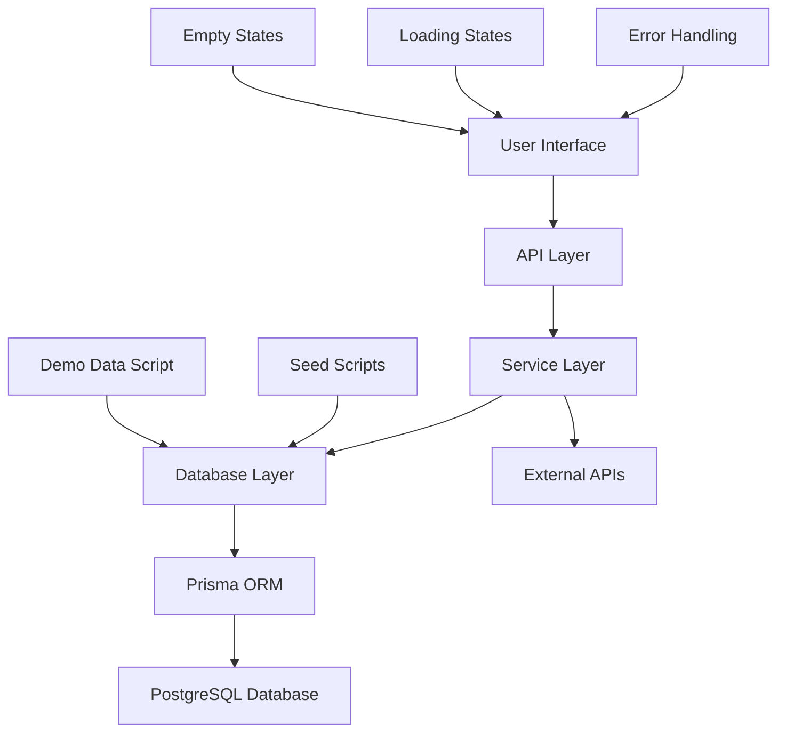
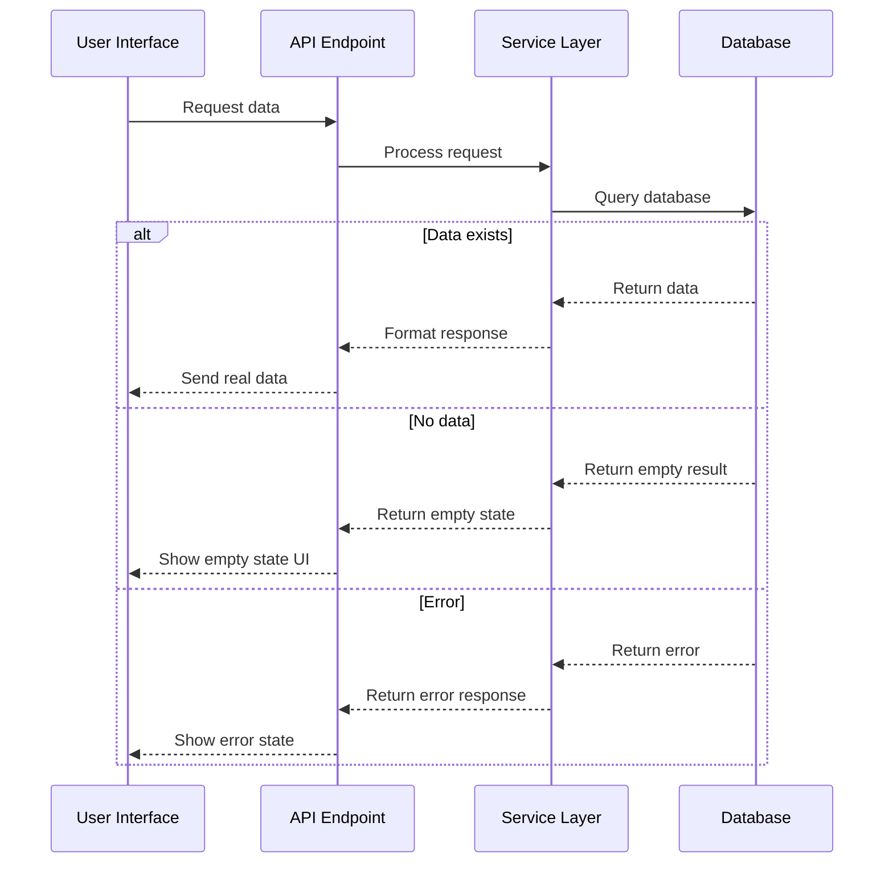

# Design Document

## Overview

This design outlines the systematic removal of all hardcoded mock data from the unified platform and replacement with proper database queries, API calls, and appropriate empty states. The solution ensures that all user-facing data is authentic and reflects the real state of the platform while maintaining good user experience through proper loading states and error handling.

## Architecture

### Data Flow Architecture



### Component Data Flow



## Components and Interfaces

### 1. Database Seeding System

#### Base Seed Script (`packages/database/prisma/seed.ts`)
- **Purpose**: Initialize essential platform data
- **Contents**:
  - Service categories and subcategories
  - System configuration settings
  - Default admin user accounts
  - Payment method configurations
  - Location data (cities, regions)

#### Demo Seed Script (`packages/database/prisma/seed-demo.ts`)
- **Purpose**: Populate database with realistic demo data for development/testing
- **Contents**:
  - Sample providers with complete profiles
  - Diverse service offerings across all categories
  - Realistic booking history
  - Customer reviews and ratings
  - Sample user accounts

#### Seed Management Interface
```typescript
interface SeedManager {
  runBaseSeed(): Promise<void>;
  runDemoSeed(): Promise<void>;
  clearDemoData(): Promise<void>;
  validateSeedData(): Promise<boolean>;
}
```

### 2. Search System Refactoring

#### Current Issues
- `mockSearchResults` array in `src/lib/search.ts`
- Fallback to mock data when database fails
- Hardcoded categories and popular searches

#### New Design
```typescript
interface SearchService {
  searchServices(filters: SearchFilters): Promise<SearchResult[]>;
  getCategories(): Promise<Category[]>;
  getPopularSearches(): Promise<string[]>;
  getSuggestions(query: string): Promise<string[]>;
}

interface SearchResult {
  // Real data from database
  id: string;
  name: string;
  description: string;
  provider: Provider;
  pricing: PricingInfo;
  availability: AvailabilityInfo;
  reviews: ReviewSummary;
}
```

### 3. Component Data Loading Pattern

#### Loading State Management
```typescript
interface DataLoadingState<T> {
  data: T | null;
  loading: boolean;
  error: string | null;
  isEmpty: boolean;
}

// Hook for consistent data loading
function useDataLoader<T>(
  fetchFn: () => Promise<T>,
  dependencies: any[]
): DataLoadingState<T>;
```

#### Empty State Components
```typescript
interface EmptyStateProps {
  title: string;
  description: string;
  action?: {
    label: string;
    onClick: () => void;
  };
  icon?: React.ComponentType;
}
```

### 4. API Endpoint Standardization

#### Response Format
```typescript
interface ApiResponse<T> {
  success: boolean;
  data: T;
  message?: string;
  pagination?: PaginationInfo;
  meta?: ResponseMetadata;
}

interface ErrorResponse {
  success: false;
  error: string;
  code: string;
  details?: any;
}
```

## Data Models

### Enhanced Database Schema Requirements

#### Categories Table
```sql
CREATE TABLE categories (
  id UUID PRIMARY KEY,
  name VARCHAR(100) NOT NULL,
  slug VARCHAR(100) UNIQUE NOT NULL,
  icon VARCHAR(50),
  description TEXT,
  is_active BOOLEAN DEFAULT true,
  sort_order INTEGER DEFAULT 0,
  created_at TIMESTAMP DEFAULT NOW(),
  updated_at TIMESTAMP DEFAULT NOW()
);
```

#### Popular Searches Tracking
```sql
CREATE TABLE search_analytics (
  id UUID PRIMARY KEY,
  query VARCHAR(255) NOT NULL,
  filters JSONB,
  result_count INTEGER,
  user_id UUID REFERENCES users(id),
  created_at TIMESTAMP DEFAULT NOW()
);

CREATE INDEX idx_search_analytics_query ON search_analytics(query);
CREATE INDEX idx_search_analytics_created_at ON search_analytics(created_at);
```

#### System Settings
```sql
CREATE TABLE system_settings (
  key VARCHAR(100) PRIMARY KEY,
  value JSONB NOT NULL,
  description TEXT,
  is_public BOOLEAN DEFAULT false,
  updated_at TIMESTAMP DEFAULT NOW()
);
```

## Error Handling

### Error Handling Strategy

#### 1. Database Connection Errors
- **Scenario**: Database is unavailable
- **Response**: Show system maintenance message
- **Fallback**: Never show mock data, display appropriate error state

#### 2. Empty Data States
- **Scenario**: No services/providers exist
- **Response**: Show onboarding or empty state UI
- **Action**: Provide clear next steps for users

#### 3. Search No Results
- **Scenario**: Search returns no matches
- **Response**: Show "no results" with suggestions
- **Action**: Offer to broaden search criteria

#### 4. Loading States
- **Scenario**: Data is being fetched
- **Response**: Show skeleton loaders or spinners
- **Timeout**: Implement reasonable timeouts with error fallback

### Error Component Design
```typescript
interface ErrorBoundaryProps {
  fallback: React.ComponentType<{error: Error}>;
  onError?: (error: Error) => void;
}

interface ErrorDisplayProps {
  error: Error;
  retry?: () => void;
  showDetails?: boolean;
}
```

## Testing Strategy

### 1. Mock Data Detection Tests
```typescript
describe('Mock Data Detection', () => {
  it('should not contain hardcoded mock arrays in components', () => {
    // Scan component files for mock data patterns
  });
  
  it('should not fallback to mock data in search', () => {
    // Test search with empty database
  });
  
  it('should handle empty states properly', () => {
    // Test all components with no data
  });
});
```

### 2. Database Integration Tests
```typescript
describe('Database Integration', () => {
  beforeEach(async () => {
    await clearDatabase();
    await runBaseSeed();
  });
  
  it('should work with minimal seed data', () => {
    // Test platform functionality with only base seed
  });
  
  it('should handle empty search results', () => {
    // Test search with no services
  });
});
```

### 3. Seed Script Validation
```typescript
describe('Seed Scripts', () => {
  it('should create valid base data', async () => {
    await runBaseSeed();
    // Validate essential data exists
  });
  
  it('should create realistic demo data', async () => {
    await runDemoSeed();
    // Validate demo data quality
  });
  
  it('should be idempotent', async () => {
    await runBaseSeed();
    await runBaseSeed(); // Should not fail or duplicate
  });
});
```

## Implementation Phases

### Phase 1: Database Seeding Infrastructure
1. Create base seed script with essential data
2. Create demo seed script with realistic sample data
3. Implement seed management commands
4. Add seed validation and cleanup utilities

### Phase 2: Search System Refactoring
1. Remove mock data from search library
2. Implement proper database queries for search
3. Add empty state handling for no results
4. Implement proper error handling for search failures

### Phase 3: Component Data Loading
1. Replace hardcoded data in all components
2. Implement consistent loading states
3. Add proper empty state components
4. Ensure all API calls use real endpoints

### Phase 4: Demo Pages and Testing
1. Update or remove demo pages that use mock data
2. Implement comprehensive testing for empty states
3. Add integration tests with minimal data
4. Validate all user flows work without mock data

### Phase 5: Production Readiness
1. Ensure production deployments only run base seed
2. Add monitoring for empty states and errors
3. Implement proper error reporting
4. Document data requirements for platform operation

## Performance Considerations

### 1. Database Query Optimization
- Use proper indexes for search queries
- Implement query result caching where appropriate
- Use pagination for large result sets
- Optimize joins and aggregations

### 2. Loading State Management
- Implement skeleton loaders for better perceived performance
- Use optimistic updates where possible
- Cache frequently accessed data
- Implement proper loading timeouts

### 3. Empty State Performance
- Avoid expensive queries when showing empty states
- Pre-calculate common empty state conditions
- Use efficient existence checks before full queries

## Security Considerations

### 1. Data Validation
- Validate all data from database before display
- Sanitize user-generated content
- Implement proper input validation for search queries

### 2. Access Control
- Ensure users only see data they're authorized to view
- Implement proper filtering for sensitive information
- Add audit logging for data access

### 3. Error Information Disclosure
- Avoid exposing sensitive database information in errors
- Log detailed errors server-side only
- Show generic error messages to users

## Monitoring and Observability

### 1. Empty State Monitoring
- Track frequency of empty states across the platform
- Monitor search queries that return no results
- Alert on unusual patterns of missing data

### 2. Error Tracking
- Monitor database connection failures
- Track API endpoint error rates
- Alert on increased error rates

### 3. Performance Monitoring
- Track query performance for data loading
- Monitor loading state durations
- Track user engagement with empty states