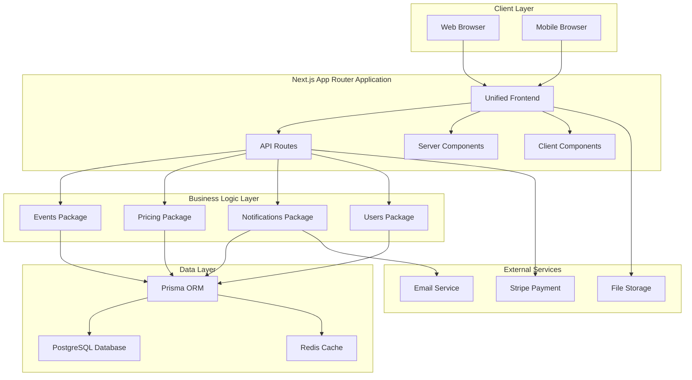
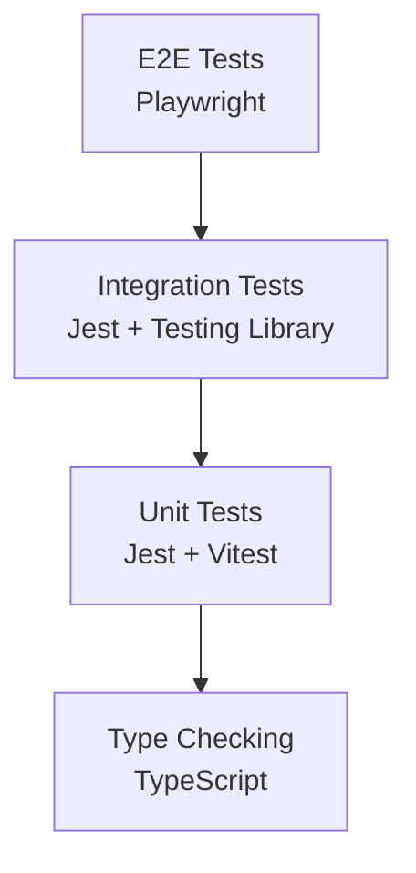

# Design Document

## Overview

The unified booking platform will consolidate the existing three Mounasabet applications (client, admin, marketing) into a single, cohesive Next.js application using the App Router architecture. The platform will provide a booking.com-like experience for event services and venues, featuring advanced search capabilities, comprehensive provider profiles, streamlined booking flows, and role-based interfaces.

The design leverages the existing robust database schema and package architecture while introducing a modern, responsive user interface that serves customers, providers, and administrators through a unified codebase.

## Architecture

### High-Level Architecture



### Application Structure

```
apps/unified-platform/
├── src/
│   ├── app/                          # Next.js App Router
│   │   ├── (customer)/               # Customer-facing routes
│   │   │   ├── page.tsx              # Homepage with search
│   │   │   ├── search/               # Search results
│   │   │   ├── providers/            # Provider profiles
│   │   │   ├── booking/              # Booking flow
│   │   │   └── account/              # Customer dashboard
│   │   ├── (provider)/               # Provider dashboard routes
│   │   │   ├── dashboard/            # Provider dashboard
│   │   │   ├── services/             # Service management
│   │   │   ├── bookings/             # Booking management
│   │   │   └── analytics/            # Performance metrics
│   │   ├── (admin)/                  # Admin panel routes
│   │   │   ├── dashboard/            # Admin dashboard
│   │   │   ├── providers/            # Provider management
│   │   │   ├── users/                # User management
│   │   │   └── platform/             # Platform settings
│   │   ├── api/                      # API routes
│   │   ├── globals.css               # Global styles
│   │   ├── layout.tsx                # Root layout
│   │   └── loading.tsx               # Global loading UI
│   ├── components/                   # Shared components
│   │   ├── ui/                       # Base UI components
│   │   ├── search/                   # Search-related components
│   │   ├── booking/                  # Booking flow components
│   │   ├── provider/                 # Provider-specific components
│   │   └── admin/                    # Admin panel components
│   ├── lib/                          # Utility functions
│   │   ├── auth.ts                   # Authentication logic
│   │   ├── search.ts                 # Search utilities
│   │   ├── booking.ts                # Booking utilities
│   │   └── validation.ts             # Form validation
│   └── types/                        # TypeScript type definitions
```

### Route Groups Strategy

The application uses Next.js App Router route groups to organize different user interfaces:

- `(customer)`: Public-facing routes for customers browsing and booking services
- `(provider)`: Protected routes for service providers managing their business
- `(admin)`: Protected routes for platform administrators

This approach allows for:
- Shared layouts within each user type
- Role-based access control
- Optimized code splitting
- Clear separation of concerns

## Components and Interfaces

### Core Components

#### 1. Search Interface
```typescript
interface SearchFilters {
  location?: string;
  category?: string;
  priceRange?: [number, number];
  rating?: number;
  availability?: DateRange;
  serviceType?: string[];
}

interface SearchResult {
  id: string;
  name: string;
  description: string;
  images: string[];
  rating: number;
  reviewCount: number;
  basePrice: number;
  location: string;
  availability: boolean;
  provider: {
    id: string;
    name: string;
    isVerified: boolean;
  };
}
```

#### 2. Provider Profile
```typescript
interface ProviderProfile {
  id: string;
  name: string;
  description: string;
  images: string[];
  rating: number;
  reviewCount: number;
  isVerified: boolean;
  services: Service[];
  packages: Package[];
  reviews: Review[];
  availability: AvailabilitySlot[];
  location: {
    address: string;
    coordinates: [number, number];
    coverageAreas: string[];
  };
  contact: {
    email: string;
    phone: string;
    website?: string;
  };
}
```

#### 3. Booking Flow
```typescript
interface BookingFlow {
  step: 'selection' | 'details' | 'payment' | 'confirmation';
  selectedServices: SelectedService[];
  eventDetails: EventDetails;
  customerInfo: CustomerInfo;
  paymentInfo: PaymentInfo;
  totalAmount: number;
}

interface SelectedService {
  serviceId: string;
  providerId: string;
  quantity: number;
  customizations?: Record<string, any>;
  dateTime: DateTime;
  duration: number;
  price: number;
}
```

### User Interface Components

#### 1. Search Components
- **SearchBar**: Main search input with autocomplete
- **FilterPanel**: Advanced filtering options
- **SearchResults**: Grid/list view of search results
- **ResultCard**: Individual service/provider card
- **MapView**: Interactive map showing provider locations

#### 2. Provider Components
- **ProviderCard**: Summary card for search results
- **ProviderProfile**: Detailed provider page
- **ServiceListing**: Individual service display
- **ReviewSection**: Customer reviews and ratings
- **AvailabilityCalendar**: Real-time availability display

#### 3. Booking Components
- **BookingWizard**: Multi-step booking process
- **ServiceSelector**: Service selection interface
- **DateTimePicker**: Date and time selection
- **CustomerForm**: Customer information collection
- **PaymentForm**: Stripe payment integration
- **BookingConfirmation**: Confirmation and receipt

#### 4. Dashboard Components
- **DashboardLayout**: Common dashboard structure
- **MetricsCards**: Key performance indicators
- **BookingsList**: Tabular booking management
- **ServiceManager**: Service creation and editing
- **AnalyticsCharts**: Performance visualization

## Data Models

### Enhanced Search Model
```typescript
interface SearchIndex {
  id: string;
  type: 'service' | 'provider' | 'package';
  name: string;
  description: string;
  category: string;
  subcategory?: string;
  location: {
    address: string;
    city: string;
    region: string;
    coordinates: [number, number];
  };
  pricing: {
    basePrice: number;
    priceUnit: string;
    priceRange: [number, number];
  };
  rating: number;
  reviewCount: number;
  availability: boolean;
  tags: string[];
  features: string[];
  searchableText: string;
  providerId: string;
  providerName: string;
  isVerified: boolean;
  createdAt: Date;
  updatedAt: Date;
}
```

### Booking State Model
```typescript
interface BookingState {
  id: string;
  customerId: string;
  status: BookingStatus;
  services: BookingService[];
  eventDetails: {
    type: string;
    date: Date;
    duration: number;
    guestCount?: number;
    location?: string;
    specialRequests?: string;
  };
  pricing: {
    subtotal: number;
    taxes: number;
    fees: number;
    total: number;
    currency: string;
  };
  payment: {
    status: PaymentStatus;
    method?: string;
    transactionId?: string;
  };
  timeline: BookingEvent[];
}
```

### User Role Model
```typescript
interface UserRole {
  id: string;
  userId: string;
  role: 'customer' | 'provider' | 'admin';
  permissions: Permission[];
  isActive: boolean;
  metadata?: Record<string, any>;
}

interface Permission {
  resource: string;
  actions: ('create' | 'read' | 'update' | 'delete')[];
  conditions?: Record<string, any>;
}
```

## Error Handling

### Error Boundary Strategy
```typescript
interface ErrorBoundaryProps {
  fallback: React.ComponentType<{ error: Error; retry: () => void }>;
  onError?: (error: Error, errorInfo: ErrorInfo) => void;
}

// Global error boundaries for different sections
- RootErrorBoundary: Catches all unhandled errors
- SearchErrorBoundary: Handles search-related errors
- BookingErrorBoundary: Manages booking flow errors
- DashboardErrorBoundary: Provider/admin dashboard errors
```

### API Error Handling
```typescript
interface APIError {
  code: string;
  message: string;
  details?: Record<string, any>;
  timestamp: Date;
  requestId: string;
}

// Standardized error responses
- ValidationError: 400 - Invalid input data
- AuthenticationError: 401 - Authentication required
- AuthorizationError: 403 - Insufficient permissions
- NotFoundError: 404 - Resource not found
- ConflictError: 409 - Resource conflict
- RateLimitError: 429 - Too many requests
- ServerError: 500 - Internal server error
```

### Client-Side Error Recovery
```typescript
interface ErrorRecoveryStrategy {
  retry: {
    maxAttempts: number;
    backoffStrategy: 'linear' | 'exponential';
    retryableErrors: string[];
  };
  fallback: {
    showFallbackUI: boolean;
    fallbackComponent?: React.ComponentType;
    redirectTo?: string;
  };
  reporting: {
    logToConsole: boolean;
    sendToService: boolean;
    includeUserContext: boolean;
  };
}
```

## Testing Strategy

### Testing Pyramid


### Test Categories

#### 1. Unit Tests
- Component rendering and behavior
- Utility function logic
- Business logic validation
- API route handlers

#### 2. Integration Tests
- Search functionality end-to-end
- Booking flow completion
- Payment processing
- Authentication flows

#### 3. E2E Tests
- Complete user journeys
- Cross-browser compatibility
- Mobile responsiveness
- Performance benchmarks

#### 4. API Tests
- Route handler functionality
- Database operations
- External service integrations
- Error handling scenarios

### Testing Infrastructure
```typescript
// Test utilities
interface TestUtils {
  renderWithProviders: (component: React.ReactNode) => RenderResult;
  createMockUser: (role: UserRole) => User;
  createMockProvider: () => Provider;
  createMockBooking: () => Booking;
  setupTestDatabase: () => Promise<void>;
  cleanupTestDatabase: () => Promise<void>;
}

// Mock services
interface MockServices {
  authService: jest.Mocked<AuthService>;
  paymentService: jest.Mocked<PaymentService>;
  emailService: jest.Mocked<EmailService>;
  searchService: jest.Mocked<SearchService>;
}
```

## Performance Optimization

### Caching Strategy
```typescript
interface CacheStrategy {
  // Static data caching
  staticData: {
    categories: 'force-cache';
    locations: 'force-cache';
    templates: { revalidate: 3600 }; // 1 hour
  };
  
  // Dynamic data caching
  dynamicData: {
    searchResults: { revalidate: 300 }; // 5 minutes
    providerProfiles: { revalidate: 600 }; // 10 minutes
    availability: 'no-store'; // Always fresh
  };
  
  // User-specific caching
  userData: {
    profile: { revalidate: 1800 }; // 30 minutes
    bookings: { revalidate: 60 }; // 1 minute
    favorites: { revalidate: 300 }; // 5 minutes
  };
}
```

### Code Splitting Strategy
```typescript
// Route-based splitting (automatic with App Router)
const CustomerRoutes = lazy(() => import('./customer'));
const ProviderRoutes = lazy(() => import('./provider'));
const AdminRoutes = lazy(() => import('./admin'));

// Component-based splitting
const SearchMap = lazy(() => import('./components/SearchMap'));
const BookingWizard = lazy(() => import('./components/BookingWizard'));
const AnalyticsDashboard = lazy(() => import('./components/AnalyticsDashboard'));

// Feature-based splitting
const PaymentModule = lazy(() => import('./features/payment'));
const ChatModule = lazy(() => import('./features/chat'));
const ReviewModule = lazy(() => import('./features/reviews'));
```

### Database Optimization
```sql
-- Search optimization indexes
CREATE INDEX idx_services_search ON services USING GIN (to_tsvector('english', name || ' ' || description));
CREATE INDEX idx_services_location ON services USING GIST (location);
CREATE INDEX idx_services_category_price ON services (category, base_price);
CREATE INDEX idx_services_rating ON services (rating DESC, review_count DESC);

-- Booking optimization indexes
CREATE INDEX idx_bookings_user_status ON bookings (user_id, status);
CREATE INDEX idx_bookings_provider_date ON bookings (provider_id, start_time);
CREATE INDEX idx_bookings_event_date ON bookings (event_id, start_time);

-- Provider optimization indexes
CREATE INDEX idx_providers_location_verified ON providers (location, is_verified);
CREATE INDEX idx_providers_rating ON providers (rating DESC, review_count DESC);
```

## Security Considerations

### Authentication & Authorization
```typescript
interface SecurityConfig {
  authentication: {
    provider: 'better-auth';
    sessionDuration: '7d';
    refreshTokenRotation: true;
    multiFactorAuth: {
      enabled: true;
      methods: ['totp', 'sms'];
    };
  };
  
  authorization: {
    rbac: true;
    permissions: {
      customer: ['read:services', 'create:bookings', 'read:own-data'];
      provider: ['read:services', 'create:services', 'manage:own-bookings'];
      admin: ['manage:all'];
    };
  };
  
  dataProtection: {
    encryption: {
      atRest: true;
      inTransit: true;
      algorithm: 'AES-256-GCM';
    };
    pii: {
      anonymization: true;
      retention: '7y';
      rightToErasure: true;
    };
  };
}
```

### Input Validation & Sanitization
```typescript
interface ValidationRules {
  search: {
    query: z.string().min(1).max(100).regex(/^[a-zA-Z0-9\s\-_]+$/);
    location: z.string().min(2).max(100);
    priceRange: z.tuple([z.number().min(0), z.number().max(100000)]);
  };
  
  booking: {
    eventDate: z.date().min(new Date()).max(addYears(new Date(), 2));
    guestCount: z.number().int().min(1).max(10000);
    specialRequests: z.string().max(1000);
  };
  
  provider: {
    businessName: z.string().min(2).max(100);
    description: z.string().min(10).max(2000);
    pricing: z.number().positive().max(100000);
  };
}
```

### Rate Limiting & DDoS Protection
```typescript
interface RateLimitConfig {
  search: {
    windowMs: 60000; // 1 minute
    maxRequests: 100;
    skipSuccessfulRequests: false;
  };
  
  booking: {
    windowMs: 300000; // 5 minutes
    maxRequests: 10;
    skipSuccessfulRequests: true;
  };
  
  api: {
    windowMs: 60000; // 1 minute
    maxRequests: 1000;
    skipSuccessfulRequests: true;
  };
}
```

This design provides a comprehensive foundation for building a unified booking platform that consolidates the existing three applications while introducing modern architecture patterns, robust error handling, comprehensive testing, performance optimization, and security best practices.