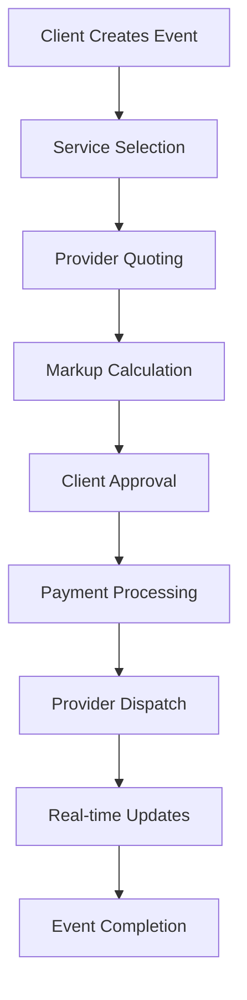

# Mounasabet - Dynamic Event Planning Platform (Turborepo Edition)


Mounasabet is a flexible SaaS platform built with Turborepo that connects event organizers with service providers for any celebration type. Featuring dynamic event management and flexible pricing models, all powered by a modern monorepo architecture.

## Technology Stack

### Core Architecture

- **Turborepo** for monorepo management
- **npm** as package manager
- **TypeScript** across all packages

### Frontend

- **Next.js 15** (App Router)
- **React 19**
- **shadcn/ui** components
- **Tailwind CSS v4** with JIT
- **Framer Motion** animations

### Backend

- **Next.js API Routes**
- **Prisma ORM** (v5.8.0)
- **PostgreSQL** database
- **better-auth** for authentication
- **Redis** for caching/real-time

### Infrastructure

- **Docker Compose** for local env
- **Vercel** for production
- **GitHub Actions** CI/CD

## Monorepo Structure with Turborepo

```
Mounasabet/
├── apps/
│   ├── client/              # Main Next.js application
│   ├── admin/               # Admin dashboard (Next.js)
│   └── api/                 # Backend API (Optional separate API)
├── packages/
│   ├── config/              # Shared configuration (eslint, tsconfig)
│   ├── ui/                  # shadcn/ui component library
│   ├── database/            # Prisma database client
│   ├── events/              # Event management core
│   ├── pricing/             # Pricing models and calculators
│   ├── utils/               # Shared utilities
│   └── types/               # Shared TypeScript definitions
├── docker-compose.yml
├── package.json
├── turbo.json               # Turborepo configuration
└── README.md
```

## Getting Started with Turborepo

### Prerequisites

- Node.js v18+
- Docker and Docker Compose
- PostgreSQL 15+
- npm v9+

### Setup Instructions

1. **Install dependencies:**

```bash
npm install
```

2. **Copy environment files:**

```bash
cp .env.example .env
# Fill in environment variables
```

3. **Start database services:**

```bash
docker-compose up -d postgres redis
```

4. **Start development servers:**

```bash
npm run dev
```

This will start:

- Client app: `http://localhost:3000`
- Admin dashboard: `http://localhost:3001`

## Turborepo Commands

| Command              | Action                          |
| -------------------- | ------------------------------- |
| `npm run build`      | Build all apps and packages     |
| `npm run dev`        | Develop all apps in parallel    |
| `npm run lint`       | Lint all workspaces             |
| `npm run clean`      | Clean all build artifacts       |
| `npm run db:migrate` | Run database migrations         |
| `npm run db:seed`    | Seed database with initial data |
| `npm run client:dev` | Dev only client app             |
| `npm run admin:dev`  | Dev only admin dashboard        |
| `npm run api:dev`    | Dev only API server             |

## Key Features

### Dynamic Event System

- Admin-configurable event types
- Custom service hierarchies
- Dynamic pricing models:
  - Fixed pricing
  - Tiered pricing
  - Provider-based dynamic
  - Option-based calculations
  - Hybrid models

### Workflow Automation



### Admin Capabilities

- Real-time event type configuration
- Pricing model management
- Provider onboarding
- Workflow customization
- Commission structure control

## Development Workflow

### Creating a New Package

```bash
npm create vite@latest packages/new-package -- --template react-ts
cd packages/new-package
npm install
```

### Adding Package Dependencies

```bash
# From monorepo root
npm install lodash-es --workspace=packages/ui
```

### Building Specific Workspace

```bash
npm run build --filter=client
```

### Turborepo Configuration (turbo.json)

```json
{
  "$schema": "https://turbo.build/schema.json",
  "tasks": {
    "build": {
      "dependsOn": ["^build"],
      "outputs": [".next/**", "!.next/cache/**"]
    },
    "lint": {},
    "dev": {
      "cache": false,
      "persistent": true
    }
  }
}
```

## Docker Setup

### docker-compose.yml

```yaml
version: "3.8"

services:
  postgres:
    image: postgres:15
    restart: always
    environment:
      POSTGRES_USER: user
      POSTGRES_PASSWORD: password
      POSTGRES_DB: mounasabet
    ports:
      - "5432:5432"
    volumes:
      - postgres_data:/var/lib/postgresql/data

  redis:
    image: redis:7
    restart: always
    ports:
      - "6379:6379"
    volumes:
      - redis_data:/data

volumes:
  postgres_data:
  redis_data:
```

## Deployment

### Vercel Setup

1. Connect your GitHub repository
2. Configure projects for each app:
   - Client: `apps/client`
   - Admin: `apps/admin`
3. Set environment variables
4. Configure build commands:

```json
// Client project
{
  "buildCommand": "npm run build --filter=client",
  "installCommand": "npm install",
  "outputDirectory": "apps/client/.next"
}

// Admin project
{
  "buildCommand": "npm run build --filter=admin",
  "outputDirectory": "apps/admin/.next"
}
```

### Production Database

Use managed PostgreSQL (AWS RDS, Supabase, Neon) with connection pooling

### CI/CD Pipeline (GitHub Actions)

```yaml
name: Mounasabet CI

on: [push]

jobs:
  build:
    runs-on: ubuntu-latest
    steps:
      - uses: actions/checkout@v3
      - uses: actions/setup-node@v3
        with:
          node-version: 18

      - name: Install dependencies
        run: npm install

      - name: Build packages
        run: npm run build

      - name: Run tests
        run: npm test

      - name: Deploy to Vercel
        uses: amondnet/vercel-action@v25
        with:
          vercel-token: ${{ secrets.VERCEL_TOKEN }}
          vercel-org-id: ${{ secrets.VERCEL_ORG_ID }}
          vercel-project-id: ${{ secrets.VERCEL_PROJECT_ID }}
          scope: Mounasabet
```

---

**Mounasabet Team**  
Event planning reimagined with Turborepo power  
contact@mounasabet.app

> "From concept to celebration - all in one monorepo"
